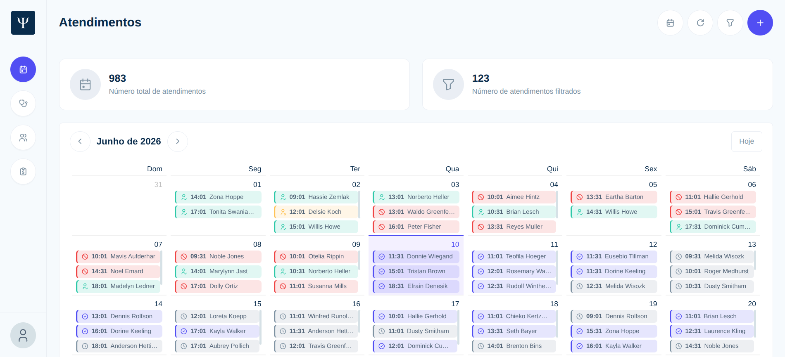
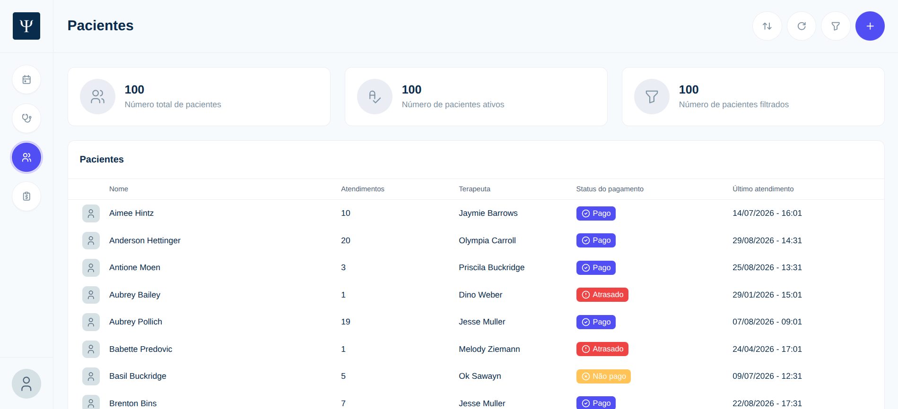
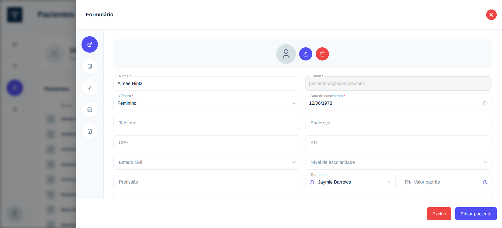
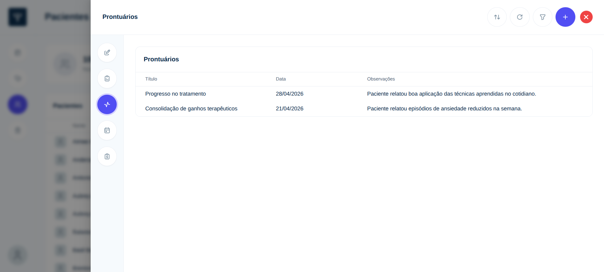
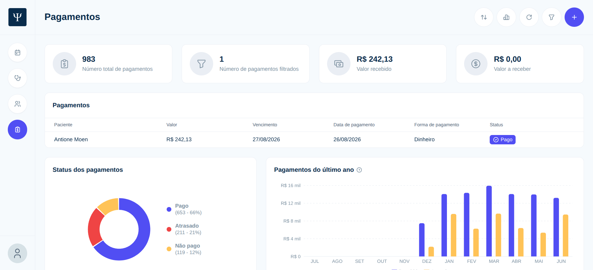

# Front-end — Sistema de Gestão de Clínica

Interface web (SPA) do sistema de gestão para o Centro de Serviços em Psicologia da FACCAT (CESEP) desenvolvido como **Trabalho de Conclusão de Curso (TCC)**. A aplicação cobre o dia a dia da clínica: **prontuário eletrônico**, **controle financeiro**, **agendamento de atendimentos** e gestão de pacientes e terapeutas.

Este repositório contém apenas o front-end. Ele consome a [API REST em Ruby on Rails](https://github.com/DKrupp03/faccat-tcc-cesep-api) (repositório git independente).

## Tecnologias

- **React 19** + **TypeScript**
- **Vite** — bundler e servidor de desenvolvimento (HMR)
- **Ant Design (antd)** — biblioteca de componentes de UI
- **React Router** — roteamento e rotas protegidas por autenticação
- **Axios** — client HTTP para consumir a API (com interceptors de token JWT)
- **i18next / react-i18next** — internacionalização (textos por módulo)
- **Recharts** — gráficos do dashboard financeiro
- **Tabler Icons** — ícones
- **ESLint** — análise estática

## Principais funcionalidades

- **Autenticação** — login, logout, recuperação e definição de senha (fluxo de e-mail), com rotas protegidas via JWT.
- **Controle de acesso por perfil** — a interface se adapta ao papel do usuário (administrador, terapeuta ou paciente).
- **Pacientes** — cadastro e gestão de pacientes, incluindo dados pessoais e foto.
- **Terapeutas** — cadastro e gestão de terapeutas e seus pacientes vinculados.
- **Anamnese** — formulário de anamnese do paciente.
- **Prontuário eletrônico** — registros de prontuário por atendimento, com anexos de documentos.
- **Agendamento de atendimentos** — serviços/sessões agendadas entre terapeuta e paciente.
- **Controle financeiro** — pagamentos por atendimento (valor, vencimento, método, comprovantes) com status (pago, em aberto, vencido) e **dashboard com gráficos** (status e evolução mensal).

## Exemplos de algumas telas

### Agendamento de atendimentos

### Pacientes

### Cadastro de paciente

### Prontuário eletrônico

### Controle financeiro

---

> Projeto de TCC. Para o tratamento de dados sensíveis e LGPD, consulte o [SECURITY.md](./SECURITY.md) na raiz do projeto.
